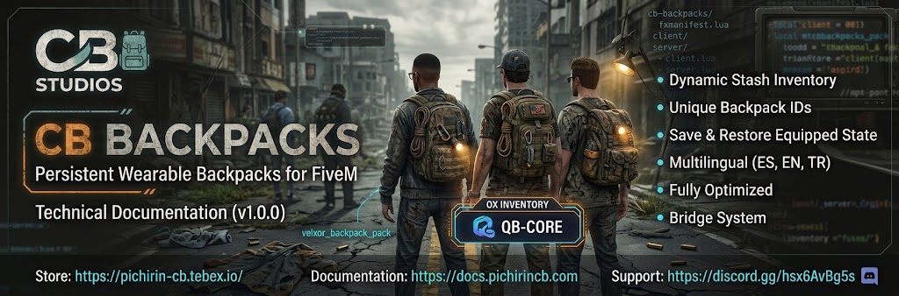

  

██████╗ ███████╗ █████╗ ██████╗ ███╗   ███╗███████╗ 
██╔══██╗██╔════╝██╔══██╗██╔══██╗████╗ ████║██╔════╝ 
██████╔╝█████╗  ███████║██║  ██║██╔████╔██║█████╗   
██╔══██╗██╔══╝  ██╔══██║██║  ██║██║╚██╔╝██║██╔══╝   
██║  ██║███████╗██║  ██║██████╔╝██║ ╚═╝ ██║███████╗ 
╚═╝  ╚═╝╚══════╝╚═╝  ╚═╝╚═════╝ ╚═╝     ╚═╝╚══════╝ 
---------------------------------------------------------------------------

# CB Backpacks - Technical Documentation

Resource Name: cb-backpacks
Version: 1.0.0
Author: CB Studios
Type: Script
Repository: https://github.com/Pichirin-CB/cb-backpacks

---------------------------------------------------------------------------

# Resource Overview

Wearable backpacks for FiveM. Using a backpack item puts the backpack
clothing on the player (component 5) and opens a persistent inventory tied to
that exact item.

- Each backpack item receives a unique ID stored in `metadata.cb_backpack_id`.
- The backpack inventory is a stash of your inventory (`ox_inventory` or `qb-inventory`) registered with that ID, so
  its contents follow the item, not the inventory slot.
- Using an equipped backpack again only opens its inventory. It is not removed
  by using it.
- The clothing is removed when the exact backpack item is no longer in the
  player's inventory (dropped, transferred, deleted).
- The equipped state is saved in SQL and restored after reconnect or restart.
- Built-in bridge (ridge/): detects the framework and the inventory
  automatically, so the main code does not depend on either.
- Notifications are translated (`es` and `en`).

---------------------------------------------------------------------------

# Resource Structure

cb-backpacks/
├─ fxmanifest.lua
├─ config.lua
├─ README.md
├─ client/main.lua
├─ server/main.lua
├─ server/version.lua
├─ bridge/
│  ├─ shared.lua
│  ├─ framework_server.lua
│  ├─ framework_client.lua
│  ├─ inventory_server.lua
│  └─ inventory_client.lua
├─ locales/
│  ├─ init.lua
│  ├─ en.lua
│  ├─ es.lua
│  └─ tr.lua
└─ INSTALL_FILES/
   ├─ ox_items.lua
   ├─ qb_items.lua
   └─ cb_backpacks.sql

---------------------------------------------------------------------------

# Installation

1.  Place the resource in your resources directory.

2.  Optional: import `INSTALL_FILES/cb_backpacks.sql`. The resource creates
    the table `cb_backpacks` automatically and migrates the old
    `container_id` column to `backpack_id`.

3.  Copy the items from `INSTALL_FILES/ox_items.lua` into
    `ox_inventory/data/items.lua`. Each item must keep:

    client = { export = 'cb-backpacks.useBackpack' }

    qb-inventory: copy `INSTALL_FILES/qb_items.lua` into
    `qb-core/shared/items.lua` instead. `unique = true` is required.
    The use is detected through the framework (no export needed).

4.  Put the item images in `ox_inventory/web/images/`
    (qb-inventory: `qb-inventory/html/images/`).

5.  Start the dependencies and the clothing pack before the resource:

    ensure ox_lib
    ensure oxmysql
    ensure ox_inventory
    ensure rpemotes-reborn      (optional)
    ensure velxor_backpack_pack
    ensure cb-backpacks

6.  Restart `ox_inventory` (items are only loaded on its start), then
    `restart cb-backpacks`.

---------------------------------------------------------------------------

# Configuration

All options are in `config.lua`.

Config.Debug    Prints debug messages in the console (default false).
Config.Locale   Notification language: 'es', 'en' or 'tr' (default 'es').

Each backpack in `Config.Backpacks`:

['backpack1'] = {
    label = 'Mochila Común',
    slots = 12,
    maxWeight = 15000,
    collection = 'velxor_backpack_pack',
    localDrawable = 7,
    texture = 0,
    component = 5,
},

- `collection` / `localDrawable`: collection name and drawable index inside
  that collection. The global drawable index is resolved at runtime with the
  FiveM collection natives, because global indexes change when other clothing
  packs or game updates change the load order.
- `drawable`: fallback global index, only used when `localDrawable` is not set.
- In `velxor_backpack_pack`, local index 1 is invisible, so it is not used.

Config.Framework and Config.Inventory: 'auto' (default) or a fixed value.

Other sections: `Config.Metadata`, `Config.Stash`, `Config.Database`,
`Config.Animation` (rpemotes-reborn emote), `Config.Restore`, `Config.Command`.

## Translations

Texts are in `locales/en.lua`, `locales/es.lua` and `locales/tr.lua`. To add a language, create
`locales/<code>.lua` with `Locales.<code> = { ... }`, add it to
`shared_scripts` in `fxmanifest.lua` and set `Config.Locale`. Missing keys
fall back to English.

Console/debug messages are always in English.

---------------------------------------------------------------------------

# Dependencies

• FiveM server with collection-based ped natives (recent artifact)
Required:
• ox_lib
• oxmysql
• A supported inventory (ox_inventory or qb-inventory)
• Clothing pack that contains the backpack (default: velxor_backpack_pack)

Optional:
• rpemotes-reborn: backpack emote. Skipped when not started.
---------------------------------------------------------------------------

# Compatibility

Framework (detected automatically, `Config.Framework`):
• Qbox (qbx_core) - tested.
• QBCore (qb-core) - implemented, not tested.
• ESX (es_extended) - implemented, not tested.
• Standalone - falls back to the player license.

Inventory (`Config.Inventory`):
• ox_inventory - implemented and tested.
• qb-inventory (qbcore-framework, v2.x exports) - written from its source and
  documentation, NOT tested in game. Forks (ps-inventory, lj-inventory) and
  older versions use different APIs and are not supported.
• Others - not implemented. See "Adding another inventory".
• Freemode male/female ped models only.

---------------------------------------------------------------------------

# Version Check

On start the server console shows whether a newer version is published. It
downloads one public JSON file and sends no server data. Disable it with
`Config.VersionCheck.enabled = false`. The installed version is the `version`
field in `fxmanifest.lua`.

---------------------------------------------------------------------------

# Commands

/backpack   (if `Config.Command.enabled`)
If a backpack is equipped, opens its inventory. Otherwise equips the first
backpack found in the player's inventory.

---------------------------------------------------------------------------

# Adding another inventory

The main code only talks to `Bridge.Inventory`. To support another
inventory, add an adapter in both files and its detection in
`bridge/shared.lua` (`Bridge.DetectInventory`).

bridge/inventory_server.lua
• RegisterStash(id, label, slots, maxWeight)
• GetSlot(source, slot)
• SetMetadata(source, slot, metadata)
• GetItems(source)
• RegisterUseable(names, fn)   (optional, see below)

bridge/inventory_client.lua
• GetItems()
• UseItem(data, cb)
• OpenStash(id)
• Close()
• OnUpdate(cb)

The item must also call the `cb-backpacks.useBackpack` export (or equivalent)
when used. In ox_inventory this is `client.export` in `items.lua`. If the
inventory has no such export, implement `RegisterUseable` on the server
adapter: the server then triggers `cb-backpacks:client:use` (name, slot), as
the qb-inventory adapter does. Items must expose their data as `metadata`.

---------------------------------------------------------------------------

# Updating the Resource

1.  Stop the resource.
2.  Backup the current version.
3.  Replace the files, keeping your `config.lua`.
4.  Review configuration changes.
5.  Restart `ox_inventory` and the resource.

---------------------------------------------------------------------------

# Troubleshooting

Console shows 'No supported inventory found'

• Start your inventory before cb-backpacks. Supported: ox_inventory and qb-inventory.

Using the backpack does nothing / no console output

• The item has `metadata.container` from an older version. ox_inventory
  then opens its own container and never calls this resource. Remove the old
  item and give a new one. Move its contents out first.
• Confirm the item has `client.export = 'cb-backpacks.useBackpack'` and that
  `ox_inventory` was restarted after editing `items.lua`.

Inventory works but the backpack is not visible

• Check that the clothing pack is started and its collection name matches
  `collection` in the config.
• Enable `Config.Debug` and read the `Resolved ...` line in F8.
• Local index 1 of `velxor_backpack_pack` has no visible model.

SQL error `Unknown column 'backpack_id'`

• Restart the resource. The table is migrated automatically.

---------------------------------------------------------------------------

# Technical Notes

Do not rename the item names or the `cb_backpack_id` metadata key on a server
that already has backpacks, or existing backpacks will lose their contents.

The resource does not copy backpack contents into its own table. Contents are
stored by your inventory.

---------------------------------------------------------------------------

# Support

If you require support provide:

Resource Name
Version
Server Build
Framework (if used)
Error logs
Description of the issue

 ██████╗██████╗     ███████╗████████╗██╗   ██╗██████╗ ██╗ ██████╗ ███████╗ 
██╔════╝██╔══██╗    ██╔════╝╚══██╔══╝██║   ██║██╔══██╗██║██╔═══██╗██╔════╝ 
██║     ██████╔╝    ███████╗   ██║   ██║   ██║██║  ██║██║██║   ██║███████╗ 
██║     ██╔══██╗    ╚════██║   ██║   ██║   ██║██║  ██║██║██║   ██║╚════██║ 
╚██████╗██████╔╝    ███████║   ██║   ╚██████╔╝██████╔╝██║╚██████╔╝███████║ 
 ╚═════╝╚═════╝     ╚══════╝   ╚═╝    ╚═════╝ ╚═════╝ ╚═╝ ╚═════╝ ╚══════╝ 

Store -> https://pichirin-cb.tebex.io/
Documentation -> https://docs.pichirincb.com
Support Discord -> https://discord.gg/hsx6AvBg5s

---------------------------------------------------------------------------

End of documentation